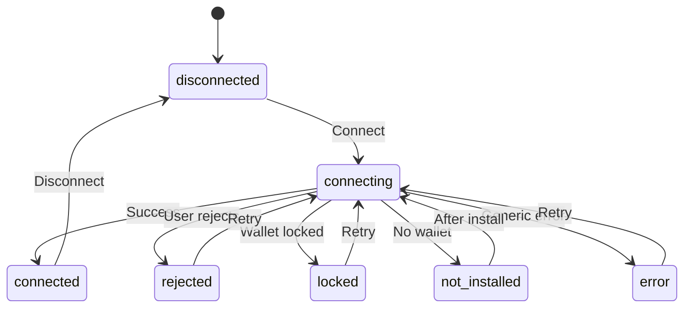

# Wallet Connection State UX Hardening

## Overview

This document outlines the enhanced wallet connection state management system that provides consistent UX across all wallet components with clear status indicators, retry affordances, and error handling.

## Problem Statement

### Before (Issues)
- **Inconsistent State Management**: Different components handled wallet states differently
- **Missing Clear Status Indicators**: Users couldn't easily understand connection status
- **No Retry Affordances**: Failed connections didn't provide clear next actions
- **Confusing Error Messages**: Generic error messages without actionable guidance
- **Inconsistent UI**: Different wallet components showed different states differently

### After (Solution)
- **Consistent State Management**: Centralized state management with clear definitions
- **Clear Status Indicators**: Visual indicators for each connection state
- **Retry Affordances**: Clear retry buttons and actions for recoverable errors
- **Actionable Error Messages**: Specific guidance for each error type
- **Normalized UI**: Consistent UI patterns across all wallet components

## Wallet Connection States

### State Definitions

| State | Description | Visual Indicator | Can Retry | User Action |
|-------|-------------|------------------|-----------|-------------|
| `disconnected` | No wallet connected | 🔌 Gray | No | Connect wallet |
| `connecting` | Connection in progress | ⏳ Blue spinner | No | Wait |
| `connected` | Successfully connected | ✅ Green pulse | No | Use wallet |
| `rejected` | User rejected connection | ❌ Red | Yes | Try again |
| `locked` | Wallet is locked | 🔒 Yellow | Yes | Unlock & retry |
| `not_installed` | Wallet not installed | ⚠️ Orange | No | Install wallet |
| `error` | Generic error | ⚠️ Red | Yes | Try again |

### State Transitions



## Implementation Details

### Enhanced Type System

```typescript
export type WalletConnectionState = 
  | 'disconnected'     // No wallet connected
  | 'connecting'       // Connection in progress
  | 'connected'        // Successfully connected
  | 'rejected'         // User rejected connection
  | 'locked'           // Wallet is locked
  | 'not_installed'    // Wallet not installed
  | 'error';           // Generic error

export interface WalletConnectionStatus {
  state: WalletConnectionState;
  error?: string;
  canRetry: boolean;
  retryAction?: () => Promise<void>;
}
```

### State Management Utility

The `WalletStateManager` class provides centralized state management:

```typescript
export class WalletStateManager {
  static getConnectionStatus(
    isConnected: boolean,
    isConnecting: boolean,
    error: string | null,
    lastError?: { code: WalletErrorCode; message: string; timestamp: number; }
  ): WalletConnectionStatus;
  
  static getErrorSolutions(state: WalletConnectionState): {
    primary: string;
    secondary?: string;
    installUrl?: string;
  };
  
  static getStateIcon(state: WalletConnectionState): string;
  static getStateColor(state: WalletConnectionState): string;
}
```

### Enhanced Hooks

#### useEnhancedWallet
Provides enhanced wallet state with consistent UX patterns:

```typescript
export const useEnhancedWallet = () => {
  const originalWallet = useOriginalWallet();
  
  // Derive connection state from original wallet properties
  const connectionState: WalletConnectionState = /* logic */;
  
  return {
    ...originalWallet,
    connectionState,
    getConnectionMessage,
    canRetry,
    getStateIcon,
    getStateColor,
    getErrorSolutions,
    retryConnection,
    clearError,
  };
};
```

#### useWalletConnectionStatus
Focused hook for connection status and retry affordances:

```typescript
export const useWalletConnectionStatus = () => {
  return {
    getConnectionState,
    getConnectionMessage,
    canRetry,
    getRetryAction,
    getStateIcon,
    getStateColor,
    getErrorSolutions,
    retryConnection,
    clearError,
  };
};
```

## UI Components

### EnhancedWalletConnect

The main wallet connection component that demonstrates the improved UX:

```typescript
const EnhancedWalletConnect: React.FC = () => {
  const { connectionState } = useEnhancedWallet();
  
  switch (connectionState) {
    case 'connected':
      return <ConnectedState />;
    case 'connecting':
      return <ConnectingState />;
    case 'rejected':
      return <RejectedState />;
    case 'locked':
      return <LockedState />;
    case 'not_installed':
      return <NotInstalledState />;
    case 'error':
      return <ErrorState />;
    default:
      return <DisconnectedState />;
  }
};
```

### State-Specific Components

Each state has its own dedicated component with appropriate UI:

- **ConnectedState**: Shows wallet info with disconnect button
- **ConnectingState**: Shows spinner and connection message
- **RejectedState**: Shows rejection message with retry/cancel
- **LockedState**: Shows locked message with unlock guidance
- **NotInstalledState**: Shows install message with download link
- **ErrorState**: Shows error message with retry/cancel
- **DisconnectedState**: Shows connect button

## Error Handling

### Error Categories

| Error Type | Wallet Error Code | State | Retry Allowed | User Action |
|------------|------------------|-------|---------------|-------------|
| Not Installed | `NOT_INSTALLED` | `not_installed` | No | Install wallet |
| User Rejected | `USER_REJECTED` | `rejected` | Yes | Try again |
| Wallet Locked | `LOCKED` | `locked` | Yes | Unlock & retry |
| Network Error | `NETWORK_ERROR` | `error` | Yes | Try again |
| Unknown Error | `UNKNOWN_ERROR` | `error` | Yes | Try again |

### Error Solutions

Each error state provides specific solutions:

```typescript
const solutions = {
  not_installed: {
    primary: 'Install Freighter Wallet',
    secondary: 'Freighter is the secure wallet for Stellar',
    installUrl: 'https://freighter.app'
  },
  rejected: {
    primary: 'Try Connecting Again',
    secondary: 'Make sure to approve the connection in Freighter'
  },
  locked: {
    primary: 'Unlock Your Wallet',
    secondary: 'Open Freighter and unlock your wallet, then retry'
  },
  error: {
    primary: 'Try Again',
    secondary: 'Check your internet connection and Freighter extension'
  }
};
```

## Testing

### Test Coverage

Comprehensive tests cover:

- **State Transitions**: All valid state transitions
- **Error Handling**: All error types and scenarios
- **Retry Logic**: When retry is/isn't allowed
- **UI Components**: Each state component renders correctly
- **Hook Behavior**: Enhanced hooks provide correct data

### Running Tests

```bash
# Run wallet state tests
npm test -- --testPathPattern=walletState

# Run with coverage
npm run test:cov -- --testPathPattern=walletState
```

## Migration Guide

### For Existing Components

1. **Replace useWallet with useEnhancedWallet**:
   ```typescript
   // Before
   const { isConnected, isConnecting, error, connect } = useWallet();
   
   // After
   const { connectionState, getConnectionMessage, canRetry, retryConnection } = useEnhancedWallet();
   ```

2. **Use State-Specific Components**:
   ```typescript
   // Before
   {isConnecting && <ConnectingSpinner />}
   {error && <ErrorMessage error={error} />}
   
   // After
   <EnhancedWalletConnect />
   ```

3. **Handle Different States**:
   ```typescript
   // Before
   if (error?.includes('not installed')) {
     return <InstallWallet />;
   }
   
   // After
   if (connectionState === 'not_installed') {
     return <InstallWallet />;
   }
   ```

### Backward Compatibility

The enhanced hooks are backward compatible with existing components. Existing code using `useWallet()` will continue to work, but new components should use the enhanced hooks for better UX.

## Best Practices

### Component Development

1. **Use Enhanced Hooks**: Prefer `useEnhancedWallet` over `useWallet`
2. **State-Specific UI**: Create dedicated components for each state
3. **Clear Actions**: Always provide clear next actions for each state
4. **Visual Indicators**: Use consistent icons and colors for states
5. **Error Messages**: Provide actionable error messages

### State Management

1. **Centralized Logic**: Use `WalletStateManager` for state logic
2. **Consistent Patterns**: Follow the established state patterns
3. **Error Handling**: Handle all error types appropriately
4. **Retry Logic**: Only allow retry for recoverable errors

### UX Design

1. **Visual Feedback**: Provide immediate visual feedback for all actions
2. **Loading States**: Show clear loading indicators during operations
3. **Error Recovery**: Provide clear paths to recover from errors
4. **Progressive Disclosure**: Show relevant information for each state

## Performance Considerations

### Optimizations

1. **Memoized State**: Use React.memo for state components
2. **Derived State**: Cache derived state calculations
3. **Event Handlers**: Optimize event handler functions
4. **Render Optimization**: Minimize unnecessary re-renders

### Monitoring

1. **State Transitions**: Track state transition success rates
2. **Error Rates**: Monitor error frequency and types
3. **User Actions**: Track user retry and success rates
4. **Performance**: Monitor component render performance

## Future Enhancements

### Planned Improvements

1. **Animation System**: Smooth transitions between states
2. **Accessibility**: Enhanced screen reader support
3. **Internationalization**: Multi-language error messages
4. **Analytics**: Detailed wallet connection analytics
5. **A/B Testing**: Test different UX patterns

### Extension Points

1. **Custom States**: Support for custom wallet states
2. **Plugin System**: Extensible error handling
3. **Theme Support**: Customizable visual themes
4. **Integration**: Third-party wallet integrations

## Conclusion

The enhanced wallet connection state system provides:

- **Consistent UX** across all wallet components
- **Clear status indicators** for users
- **Actionable error messages** with retry affordances
- **Comprehensive testing** for reliability
- **Backward compatibility** for existing code
- **Future-proof architecture** for enhancements

This system significantly improves the user experience when connecting and managing wallet connections, providing clear feedback and actionable guidance at every step.
